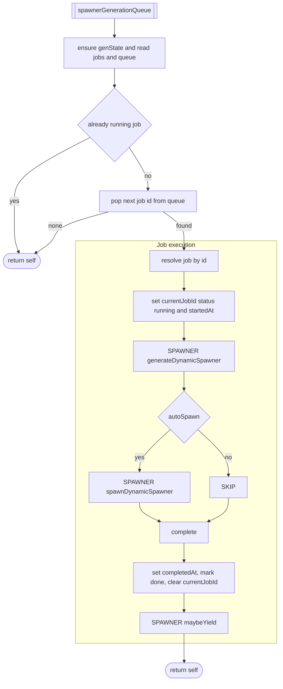
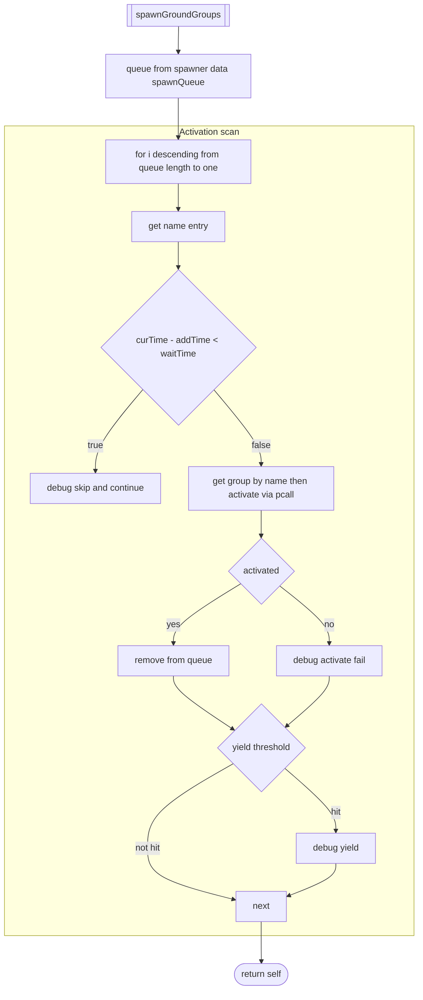
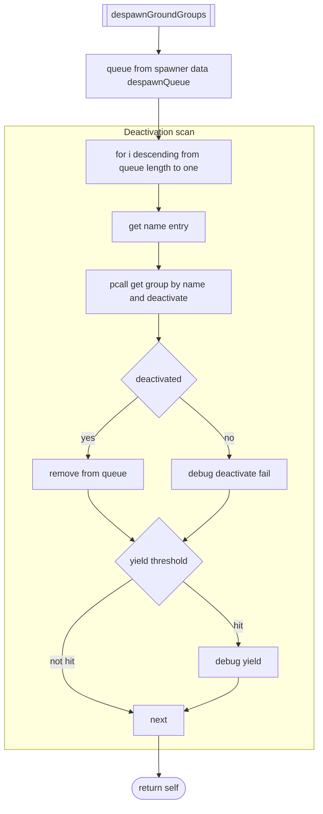
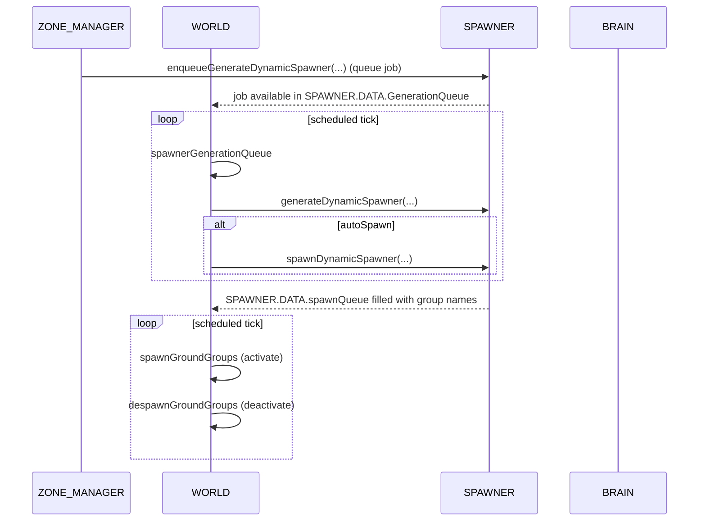

# WORLD ↔ SPAWNER integration

### Primary WORLD anchors
- Generation dispatch: [AETHR.WORLD:spawnerGenerationQueue()](https://github.com/Gh0st352/AETHR/blob/main/dev/WORLD.lua#L801)
- Activation: [AETHR.WORLD:spawnGroundGroups()](https://github.com/Gh0st352/AETHR/blob/main/dev/WORLD.lua#L538)
- Deactivation: [AETHR.WORLD:despawnGroundGroups()](https://github.com/Gh0st352/AETHR/blob/main/dev/WORLD.lua#L590)

### Related SPAWNER anchors
- Enqueue job: [AETHR.SPAWNER:enqueueGenerateDynamicSpawner()](https://github.com/Gh0st352/AETHR/blob/main/dev/SPAWNER.lua#L520)
- Main generation: [AETHR.SPAWNER:generateDynamicSpawner()](https://github.com/Gh0st352/AETHR/blob/main/dev/SPAWNER.lua#L563)
- Placement, building, and counts: see SPAWNER index [../spawner/README.md](../spawner/README.md)

### Coroutine controls
- WORLD uses BRAIN coroutine configs:
  - spawn generation queue: `self.SPAWNER.DATA._genState` and `self.SPAWNER:_maybeYield(...)`
  - spawn/despawn loops: `self.BRAIN.DATA.coroutines.spawnGroundGroups` / `despawnGroundGroups`

# spawnerGenerationQueue

Processes one queued generation job per invocation, marking job status and timestamps. Heavy work yields deep inside SPAWNER via `_maybeYield`.

### Anchors
- Entry: [AETHR.WORLD:spawnerGenerationQueue()](https://github.com/Gh0st352/AETHR/blob/main/dev/WORLD.lua#L801)
- SPAWNER calls: [AETHR.SPAWNER:generateDynamicSpawner()](https://github.com/Gh0st352/AETHR/blob/main/dev/SPAWNER.lua#L563)

# spawnGroundGroups

Activates groups by name when their engine add time has aged past the configured wait window.

### Anchors
- [AETHR.WORLD:spawnGroundGroups()](https://github.com/Gh0st352/AETHR/blob/main/dev/WORLD.lua#L538)

# despawnGroundGroups

Deactivates groups by name using trigger.action.deactivateGroup and removes successful entries from the queue.

### Anchors
- [AETHR.WORLD:despawnGroundGroups()](https://github.com/Gh0st352/AETHR/blob/main/dev/WORLD.lua#L590)

# Sequence overview

### Notes
- Activation defers until `UTILS:getTime() - group._engineAddTime >= SPAWNER.DATA.CONFIG.SPAWNER_WAIT_TIME`.
- All engine calls guarded by pcall to avoid hard faults when objects are missing.
- Yielding behavior controlled by `BRAIN.DATA.coroutines.spawnGroundGroups` and `.despawnGroundGroups`.

# Anchor index

- WORLD
  - Generation: [AETHR.WORLD:spawnerGenerationQueue()](https://github.com/Gh0st352/AETHR/blob/main/dev/WORLD.lua#L801)
  - Activation: [AETHR.WORLD:spawnGroundGroups()](https://github.com/Gh0st352/AETHR/blob/main/dev/WORLD.lua#L538)
  - Deactivation: [AETHR.WORLD:despawnGroundGroups()](https://github.com/Gh0st352/AETHR/blob/main/dev/WORLD.lua#L590)
- SPAWNER
  - Enqueue: [AETHR.SPAWNER:enqueueGenerateDynamicSpawner()](https://github.com/Gh0st352/AETHR/blob/main/dev/SPAWNER.lua#L520)
  - Generate: [AETHR.SPAWNER:generateDynamicSpawner()](https://github.com/Gh0st352/AETHR/blob/main/dev/SPAWNER.lua#L563)
- Related
  - SPAWNER pipeline: [../spawner/pipeline.md](../spawner/pipeline.md)