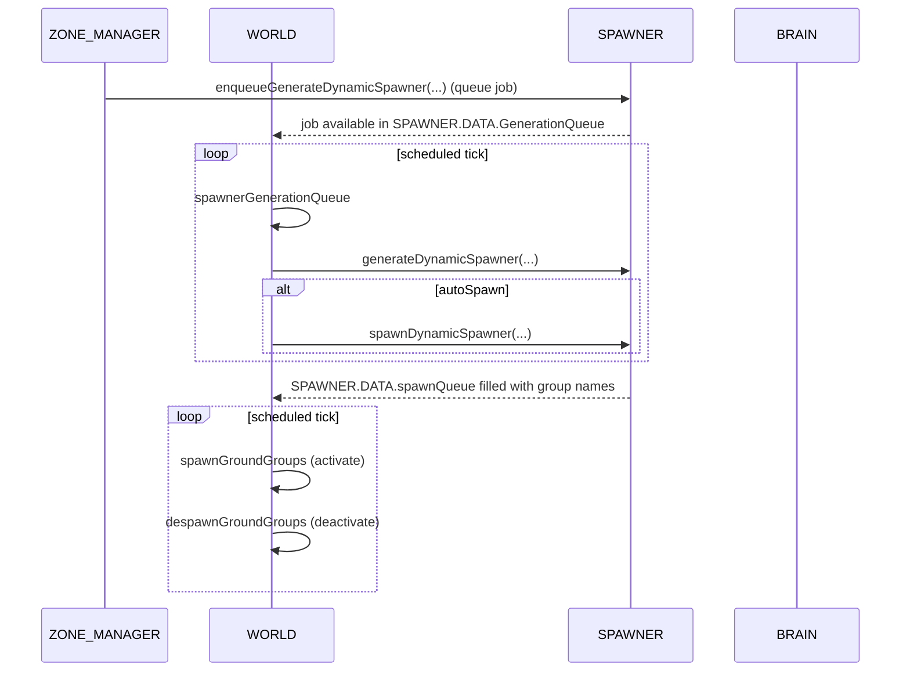

# WORLD ↔ SPAWNER integration

Primary WORLD anchors
- Generation dispatch: [AETHR.WORLD:spawnerGenerationQueue()](dev/WORLD.lua:801)
- Activation: [AETHR.WORLD:spawnGroundGroups()](dev/WORLD.lua:538)
- Deactivation: [AETHR.WORLD:despawnGroundGroups()](dev/WORLD.lua:590)

Related SPAWNER anchors
- Enqueue job: [AETHR.SPAWNER:enqueueGenerateDynamicSpawner()](dev/SPAWNER.lua:520)
- Main generation: [AETHR.SPAWNER:generateDynamicSpawner()](dev/SPAWNER.lua:563)
- Placement, building, and counts: see SPAWNER index [docs/spawner/README.md](docs/spawner/README.md)

Coroutine controls
- WORLD uses BRAIN coroutine configs:
  - spawn generation queue: `self.SPAWNER.DATA._genState` and `self.SPAWNER:_maybeYield(...)`
  - spawn/despawn loops: `self.BRAIN.DATA.coroutines.spawnGroundGroups` / `despawnGroundGroups`

## spawnerGenerationQueue

Processes one queued generation job per invocation, marking job status and timestamps. Heavy work yields deep inside SPAWNER via `_maybeYield`.

```mermaid
flowchart TD
  SGQ[[spawnerGenerationQueue]] --> STATE[ensure DATA._genState; read jobs and queue]
  STATE --> RUN{already running job?}
  RUN -- yes --> RET0([return self])
  RUN -- no --> NEXTID[pop next jobId from GenerationQueue]
  NEXTID -- none --> RET0
  NEXTID -- found --> JOBJ[resolve job by id]
  JOBJ --> MARK[set state.currentJobId; job.status='running'; startedAt=UTILS.getTime()]
  MARK --> CALL[SPAWNER.generateDynamicSpawner(dynamicSpawner, vec2, radii, nudge, countryID)]
  CALL --> OPT{autoSpawn?}
  OPT -- yes --> SPAWN[SPAWNER.spawnDynamicSpawner(dynamicSpawner, countryID)]
  OPT -- no --> SKIP
  SPAWN --> DONE
  SKIP --> DONE
  DONE --> FIN[set completedAt; status='done'; clear currentJobId]
  FIN --> YIELD[SPAWNER._maybeYield(1)]
  YIELD --> RET([return self])
```

Anchors
- Entry: [AETHR.WORLD:spawnerGenerationQueue()](dev/WORLD.lua:801)
- SPAWNER calls: [AETHR.SPAWNER:generateDynamicSpawner()](dev/SPAWNER.lua:563)

## spawnGroundGroups

Activates groups by name when their engine add time has aged past the configured wait window.

```mermaid
flowchart TD
  SGG[[spawnGroundGroups]] --> Q[queue = SPAWNER.DATA.spawnQueue]
  Q --> LOOP[for i = #queue .. 1]
  LOOP --> NAME[name = queue[i]]
  NAME --> WAIT[compute curTime - groupAddTime < waitTime?]
  WAIT -- true --> SKIP[debug: skip; continue]
  WAIT -- false --> ACT[Group.getByName(name); Group.activate(g) via pcall]
  ACT --> RES{activated?}
  RES -- yes --> REM[table.remove(queue, i)]
  RES -- no --> DBG[debug: activateFail]
  REM --> YLD{yield threshold?}
  DBG --> YLD
  YLD -- hit --> CY[debug 'YIELD' + coroutine.yield()]
  YLD -- not hit --> NEXT
  CY --> NEXT
  NEXT --> END([return self])
```

Anchors
- [AETHR.WORLD:spawnGroundGroups()](dev/WORLD.lua:538)

## despawnGroundGroups

Deactivates groups by name using trigger.action.deactivateGroup and removes successful entries from the queue.

```mermaid
flowchart TD
  DSG[[despawnGroundGroups]] --> QD[queue = SPAWNER.DATA.despawnQueue]
  QD --> LOOP[for i = #queue .. 1]
  LOOP --> NAME[name = queue[i]]
  NAME --> TRY[pcall: Group.getByName(name); trigger.action.deactivateGroup(g)]
  TRY --> RES{deactivated?}
  RES -- yes --> REM[table.remove(queue, i)]
  RES -- no --> DBG[debug: deactivateFail]
  REM --> YLD{yield threshold?}
  DBG --> YLD
  YLD -- hit --> CY[debug 'YIELD' + coroutine.yield()]
  YLD -- not hit --> NEXT
  CY --> NEXT
  NEXT --> END([return self])
```

Anchors
- [AETHR.WORLD:despawnGroundGroups()](dev/WORLD.lua:590)

## Sequence overview



Notes
- Activation defers until `UTILS:getTime() - group._engineAddTime >= SPAWNER.DATA.CONFIG.SPAWNER_WAIT_TIME`.
- All engine calls guarded by pcall to avoid hard faults when objects are missing.
- Yielding behavior controlled by `BRAIN.DATA.coroutines.spawnGroundGroups` and `.despawnGroundGroups`.

## Anchor index

- WORLD
  - Generation: [AETHR.WORLD:spawnerGenerationQueue()](dev/WORLD.lua:801)
  - Activation: [AETHR.WORLD:spawnGroundGroups()](dev/WORLD.lua:538)
  - Deactivation: [AETHR.WORLD:despawnGroundGroups()](dev/WORLD.lua:590)
- SPAWNER
  - Enqueue: [AETHR.SPAWNER:enqueueGenerateDynamicSpawner()](dev/SPAWNER.lua:520)
  - Generate: [AETHR.SPAWNER:generateDynamicSpawner()](dev/SPAWNER.lua:563)
- Related
  - SPAWNER pipeline: [docs/spawner/pipeline.md](docs/spawner/pipeline.md)