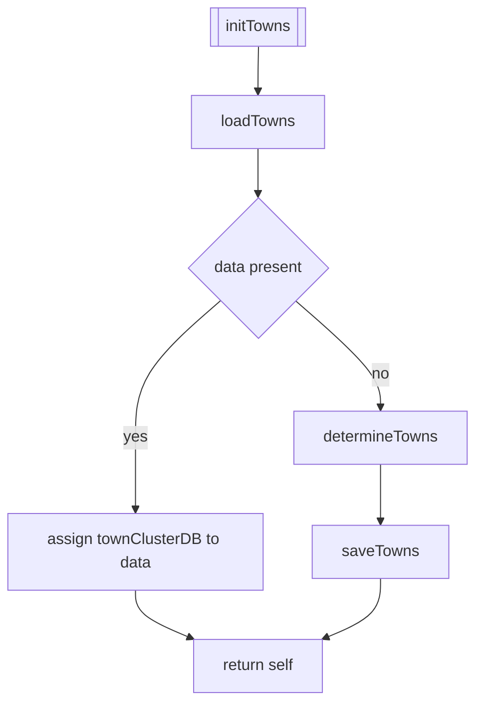
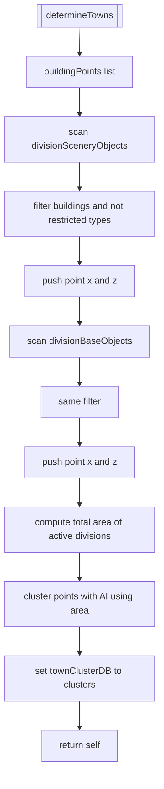
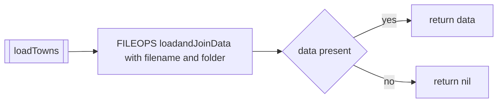
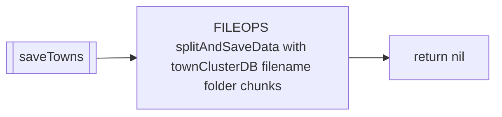
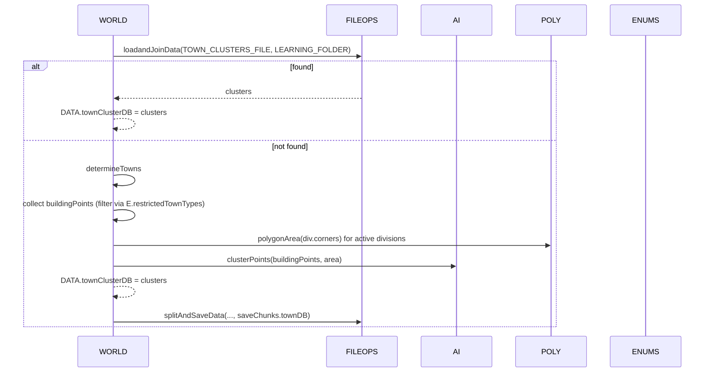

# WORLD town clustering

Primary anchors
- Determine clusters:
  - [AETHR.WORLD:determineTowns()](dev/WORLD.lua:1460)
- Init/load/save:
  - [AETHR.WORLD:initTowns()](dev/WORLD.lua:1513)
  - [AETHR.WORLD:loadTowns()](dev/WORLD.lua:1528)
  - [AETHR.WORLD:saveTowns()](dev/WORLD.lua:1541)

Related modules and config
- Storage helpers: [dev/FILEOPS_.lua](dev/FILEOPS_.lua)
- Geometry helpers: [dev/POLY.lua](dev/POLY.lua)
- AI clustering: [dev/_AI.lua](dev/_AI.lua)
- Enums and filters: [dev/ENUMS.lua](dev/ENUMS.lua)
- Config paths/files and save chunking: [dev/CONFIG_.lua](dev/CONFIG_.lua)

## Overview

The town clustering flow aggregates building object positions from cached per-division scenery and base objects, filters by allowed building types, estimates map area over active divisions, and runs an AI-assisted clustering to produce a towns database.

## determineTowns

- Extract points (x,z) from:
  - `DATA.divisionSceneryObjects[div][object]`
  - `DATA.divisionBaseObjects[div][object]`
- Filter to building-like objects (`desc.attributes.Buildings == true`) and not in `ENUMS.restrictedTownTypes[typeName]`.
- Area estimate: sum polygon areas of active divisions: `sum(POLY:polygonArea(div.corners))`.
- Cluster: `AI:clusterPoints(buildingPoints, area)`; store in `DATA.townClusterDB`.

Notes
- Uses `DATA.divisionSceneryObjects` and `DATA.divisionBaseObjects` produced by the per-division initialization flows described in [docs/world/objects_and_db.md](docs/world/objects_and_db.md).
- Area normalization helps the clustering algorithm pick reasonable cluster sizes for the map scale.

## Storage

- loadTowns reads a possibly chunked dataset (joined) from `CONFIG.MAIN.STORAGE.PATHS.LEARNING_FOLDER` using filename `CONFIG.MAIN.STORAGE.FILENAMES.TOWN_CLUSTERS_FILE`.
- saveTowns writes with chunking via `FILEOPS:splitAndSaveData` using `CONFIG.MAIN.saveChunks.townDB`.

## Sequence overview

## Anchor index

- Core
  - [AETHR.WORLD:determineTowns()](dev/WORLD.lua:1460)
  - [AETHR.WORLD:initTowns()](dev/WORLD.lua:1513)
  - [AETHR.WORLD:loadTowns()](dev/WORLD.lua:1528)
  - [AETHR.WORLD:saveTowns()](dev/WORLD.lua:1541)
- Related
  - Per-division caches used as inputs: [docs/world/objects_and_db.md](docs/world/objects_and_db.md)