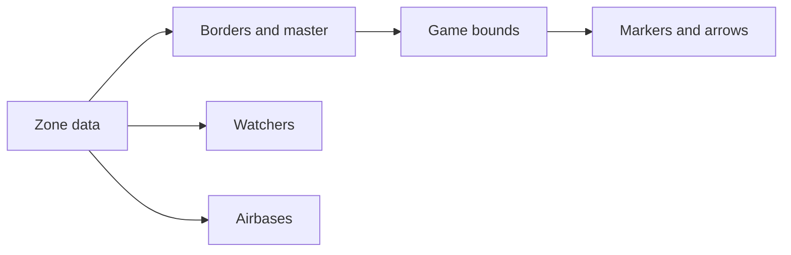

# AETHR ZONE_MANAGER diagrams index

Primary module entries
- Init data: [AETHR.ZONE_MANAGER:initMizZoneData()](../../dev/ZONE_MANAGER.lua:122), [AETHR.ZONE_MANAGER:initGameZoneBoundaries()](../../dev/ZONE_MANAGER.lua:860)
- Generate: [AETHR.ZONE_MANAGER:generateMizZoneData()](../../dev/ZONE_MANAGER.lua:205), [AETHR.ZONE_MANAGER:generateGameBoundData()](../../dev/ZONE_MANAGER.lua:895)
- Draw: [AETHR.ZONE_MANAGER:drawMissionZones()](../../dev/ZONE_MANAGER.lua:980), [AETHR.ZONE_MANAGER:drawGameBounds()](../../dev/ZONE_MANAGER.lua:931), [AETHR.ZONE_MANAGER:drawZoneArrows()](../../dev/ZONE_MANAGER.lua:1025)

Documents
- Zone data: [docs/zone_manager/zone_data.md](docs/zone_manager/zone_data.md)
- Borders and master: [docs/zone_manager/borders_and_master.md](docs/zone_manager/borders_and_master.md)
- Game bounds: [docs/zone_manager/game_bounds.md](docs/zone_manager/game_bounds.md)
- Markers and arrows: [docs/zone_manager/markers_and_arrows.md](docs/zone_manager/markers_and_arrows.md)
- Watchers: [docs/zone_manager/watchers.md](docs/zone_manager/watchers.md)
- Airbases: [docs/zone_manager/airbases.md](docs/zone_manager/airbases.md)

End to end relationship



Key anchors
- Normalization and storage
  - [AETHR.ZONE_MANAGER:_normalizeMizZones()](../../dev/ZONE_MANAGER.lua:53)
  - [AETHR.ZONE_MANAGER:getStoredMizZoneData()](../../dev/ZONE_MANAGER.lua:141), [AETHR.ZONE_MANAGER:saveMizZoneData()](../../dev/ZONE_MANAGER.lua:152)
  - [AETHR.ZONE_MANAGER:getStoredGameBoundData()](../../dev/ZONE_MANAGER.lua:874), [AETHR.ZONE_MANAGER:saveGameBoundData()](../../dev/ZONE_MANAGER.lua:885)
- Border detection and master polygon
  - [AETHR.ZONE_MANAGER:determineBorderingZones()](../../dev/ZONE_MANAGER.lua:232)
  - [AETHR.ZONE_MANAGER:getMasterZonePolygon()](../../dev/ZONE_MANAGER.lua:520)
- Out of bounds, hull processing, and gaps
  - [AETHR.ZONE_MANAGER:getOutOfBounds()](../../dev/ZONE_MANAGER.lua:799)
  - [AETHR.ZONE_MANAGER:_buildBorderExclude()](../../dev/ZONE_MANAGER.lua:356)
  - [AETHR.ZONE_MANAGER:_collectPolygonsFromZones()](../../dev/ZONE_MANAGER.lua:385)
  - [AETHR.ZONE_MANAGER:_flattenUniquePoints()](../../dev/ZONE_MANAGER.lua:410)
  - [AETHR.ZONE_MANAGER:_processHullLoop()](../../dev/ZONE_MANAGER.lua:449)
  - [AETHR.ZONE_MANAGER:getPolygonCutout()](../../dev/ZONE_MANAGER.lua:566)
- Drawing flows
  - [AETHR.ZONE_MANAGER:drawZone()](../../dev/ZONE_MANAGER.lua:329)
  - [AETHR.ZONE_MANAGER:drawMissionZones()](../../dev/ZONE_MANAGER.lua:980)
  - [AETHR.ZONE_MANAGER:drawGameBounds()](../../dev/ZONE_MANAGER.lua:931)
  - [AETHR.ZONE_MANAGER:initZoneArrows()](../../dev/ZONE_MANAGER.lua:1075), [AETHR.ZONE_MANAGER:drawZoneArrows()](../../dev/ZONE_MANAGER.lua:1025)
- Watchers and ownership
  - [AETHR.ZONE_MANAGER:initWatcher_AirbaseOwnership()](../../dev/ZONE_MANAGER.lua:1103)
  - [AETHR.ZONE_MANAGER:initWatcher_ZoneOwnership()](../../dev/ZONE_MANAGER.lua:1113)

Cross-module anchors
- Geometry
  - [AETHR.POLY:convertPolygonToLines()](../../dev/POLY.lua:737), [AETHR.POLY:convertLinesToPolygon()](../../dev/POLY.lua:582)
  - [AETHR.POLY:pointInPolygon()](../../dev/POLY.lua:66), [AETHR.POLY:isWithinOffset()](../../dev/POLY.lua:1106)
  - [AETHR.POLY:getMidpoint()](../../dev/POLY.lua:1171), [AETHR.POLY:calculateLineSlope()](../../dev/POLY.lua:1186), [AETHR.POLY:findPerpendicularEndpoints()](../../dev/POLY.lua:1218)
  - [AETHR.POLY:concaveHull()](../../dev/POLY.lua:1309), [AETHR.POLY:convexHull()](../../dev/POLY.lua:1461), [AETHR.POLY:intersectRayToBounds()](../../dev/POLY.lua:1491)
  - [AETHR.POLY:densifyHullEdges()](../../dev/POLY.lua:1556), [AETHR.POLY:findOverlaidPolygonGaps()](../../dev/POLY.lua:1618), [AETHR.POLY:reverseVertOrder()](../../dev/POLY.lua:1761)
  - [AETHR.POLY:convertBoundsToPolygon()](../../dev/POLY.lua:1039)
- World
  - [AETHR.WORLD:getAirbases()](../../dev/WORLD.lua:428)
  - [AETHR.WORLD:airbaseOwnershipChanged()](../../dev/WORLD.lua:970), [AETHR.WORLD:zoneOwnershipChanged()](../../dev/WORLD.lua:1006)
  - [AETHR.WORLD:updateZoneArrows()](../../dev/WORLD.lua:730)
- Markers and utils
  - [AETHR.MARKERS:markFreeform()](../../dev/MARKERS.lua:43), [AETHR.MARKERS:markArrow()](../../dev/MARKERS.lua:138)
  - [AETHR.UTILS:updateMarkupColors()](../../dev/UTILS.lua:188)
- Spawner
  - [AETHR.SPAWNER:spawnAirbaseFill()](../../dev/SPAWNER.lua:2169)

Module interactions during runtime

```mermaid
sequenceDiagram
  participant A as AETHR
  participant Z as ZONE_MANAGER
  participant W as WORLD
  participant P as POLY
  participant M as MARKERS
  participant U as UTILS
  A->>Z: initMizZoneData
  alt stored data present
    Z-->>Z: load and normalize
  else
    Z->>Z: generateMizZoneData
    Z->>W: getAirbases
    Z->>Z: saveMizZoneData
  end
  Z->>Z: initGameZoneBoundaries
  Z->>Z: generateGameBoundData
  Z->>P: polygon and hull helpers
  Z->>M: drawMissionZones and drawGameBounds
  Z->>Z: initZoneArrows
  W->>U: update markup colors for arrows