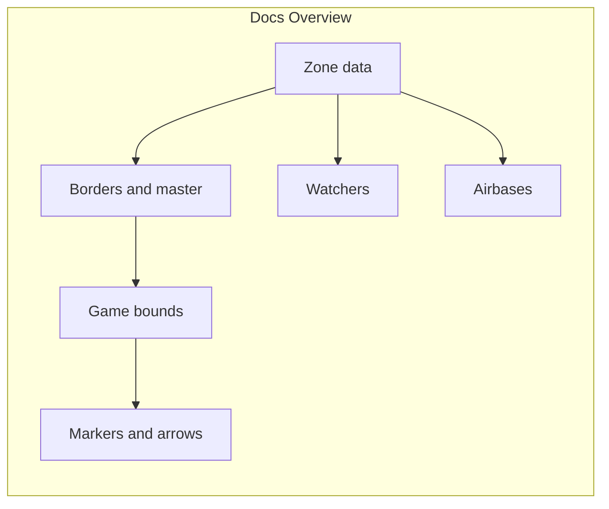
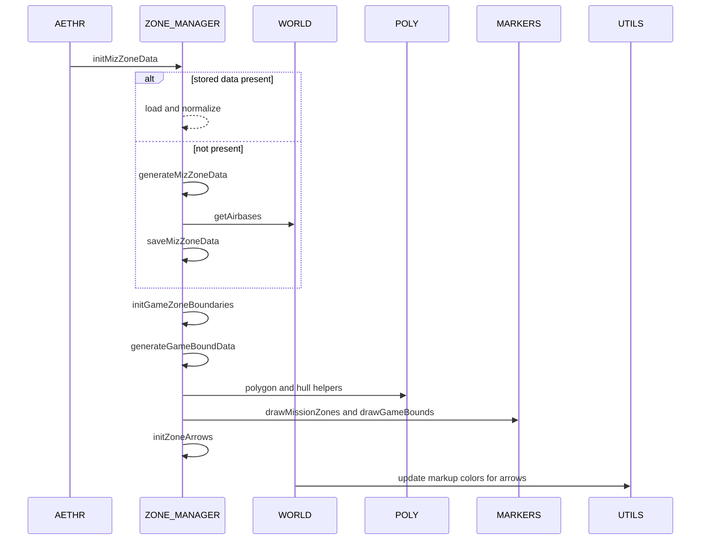

# AETHR ZONE_MANAGER diagrams index

### Primary module entries
- Init data: [AETHR.ZONE_MANAGER:initMizZoneData()](https://github.com/Gh0st352/AETHR/blob/main/dev/ZONE_MANAGER.lua#L122), [AETHR.ZONE_MANAGER:initGameZoneBoundaries()](https://github.com/Gh0st352/AETHR/blob/main/dev/ZONE_MANAGER.lua#L860)
- Generate: [AETHR.ZONE_MANAGER:generateMizZoneData()](https://github.com/Gh0st352/AETHR/blob/main/dev/ZONE_MANAGER.lua#L205), [AETHR.ZONE_MANAGER:generateGameBoundData()](https://github.com/Gh0st352/AETHR/blob/main/dev/ZONE_MANAGER.lua#L895)
- Draw: [AETHR.ZONE_MANAGER:drawMissionZones()](https://github.com/Gh0st352/AETHR/blob/main/dev/ZONE_MANAGER.lua#L980), [AETHR.ZONE_MANAGER:drawGameBounds()](https://github.com/Gh0st352/AETHR/blob/main/dev/ZONE_MANAGER.lua#L931), [AETHR.ZONE_MANAGER:drawZoneArrows()](https://github.com/Gh0st352/AETHR/blob/main/dev/ZONE_MANAGER.lua#L1025)

### Documents
- Zone data: [docs/zone_manager/zone_data.md](docs/zone_manager/zone_data.md)
- Borders and master: [docs/zone_manager/borders_and_master.md](docs/zone_manager/borders_and_master.md)
- Game bounds: [docs/zone_manager/game_bounds.md](docs/zone_manager/game_bounds.md)
- Markers and arrows: [docs/zone_manager/markers_and_arrows.md](docs/zone_manager/markers_and_arrows.md)
- Watchers: [docs/zone_manager/watchers.md](docs/zone_manager/watchers.md)
- Airbases: [docs/zone_manager/airbases.md](docs/zone_manager/airbases.md)
- Towns: [docs/zone_manager/towns.md](docs/zone_manager/towns.md)

# End to end relationship

### Key anchors
- Normalization and storage
  - [AETHR.ZONE_MANAGER:_normalizeMizZones()](https://github.com/Gh0st352/AETHR/blob/main/dev/ZONE_MANAGER.lua#L53)
  - [AETHR.ZONE_MANAGER:getStoredMizZoneData()](https://github.com/Gh0st352/AETHR/blob/main/dev/ZONE_MANAGER.lua#L141), [AETHR.ZONE_MANAGER:saveMizZoneData()](https://github.com/Gh0st352/AETHR/blob/main/dev/ZONE_MANAGER.lua#L152)
  - [AETHR.ZONE_MANAGER:getStoredGameBoundData()](https://github.com/Gh0st352/AETHR/blob/main/dev/ZONE_MANAGER.lua#L874), [AETHR.ZONE_MANAGER:saveGameBoundData()](https://github.com/Gh0st352/AETHR/blob/main/dev/ZONE_MANAGER.lua#L885)
- Border detection and master polygon
  - [AETHR.ZONE_MANAGER:determineBorderingZones()](https://github.com/Gh0st352/AETHR/blob/main/dev/ZONE_MANAGER.lua#L232)
  - [AETHR.ZONE_MANAGER:getMasterZonePolygon()](https://github.com/Gh0st352/AETHR/blob/main/dev/ZONE_MANAGER.lua#L520)
- Out of bounds, hull processing, and gaps
  - [AETHR.ZONE_MANAGER:getOutOfBounds()](https://github.com/Gh0st352/AETHR/blob/main/dev/ZONE_MANAGER.lua#L799)
  - [AETHR.ZONE_MANAGER:_buildBorderExclude()](https://github.com/Gh0st352/AETHR/blob/main/dev/ZONE_MANAGER.lua#L356)
  - [AETHR.ZONE_MANAGER:_collectPolygonsFromZones()](https://github.com/Gh0st352/AETHR/blob/main/dev/ZONE_MANAGER.lua#L385)
  - [AETHR.ZONE_MANAGER:_flattenUniquePoints()](https://github.com/Gh0st352/AETHR/blob/main/dev/ZONE_MANAGER.lua#L410)
  - [AETHR.ZONE_MANAGER:_processHullLoop()](https://github.com/Gh0st352/AETHR/blob/main/dev/ZONE_MANAGER.lua#L449)
  - [AETHR.ZONE_MANAGER:getPolygonCutout()](https://github.com/Gh0st352/AETHR/blob/main/dev/ZONE_MANAGER.lua#L566)
- Drawing flows
  - [AETHR.ZONE_MANAGER:drawZone()](https://github.com/Gh0st352/AETHR/blob/main/dev/ZONE_MANAGER.lua#L329)
  - [AETHR.ZONE_MANAGER:drawMissionZones()](https://github.com/Gh0st352/AETHR/blob/main/dev/ZONE_MANAGER.lua#L980)
  - [AETHR.ZONE_MANAGER:drawGameBounds()](https://github.com/Gh0st352/AETHR/blob/main/dev/ZONE_MANAGER.lua#L931)
  - [AETHR.ZONE_MANAGER:initZoneArrows()](https://github.com/Gh0st352/AETHR/blob/main/dev/ZONE_MANAGER.lua#L1075), [AETHR.ZONE_MANAGER:drawZoneArrows()](https://github.com/Gh0st352/AETHR/blob/main/dev/ZONE_MANAGER.lua#L1025)
- Watchers and ownership
  - [AETHR.ZONE_MANAGER:initWatcher_AirbaseOwnership()](https://github.com/Gh0st352/AETHR/blob/main/dev/ZONE_MANAGER.lua#L1103)
  - [AETHR.ZONE_MANAGER:initWatcher_ZoneOwnership()](https://github.com/Gh0st352/AETHR/blob/main/dev/ZONE_MANAGER.lua#L1113)

### Cross-module anchors
- Geometry
  - [AETHR.POLY:convertPolygonToLines()](https://github.com/Gh0st352/AETHR/blob/main/dev/POLY.lua#L737), [AETHR.POLY:convertLinesToPolygon()](https://github.com/Gh0st352/AETHR/blob/main/dev/POLY.lua#L582)
  - [AETHR.POLY:pointInPolygon()](https://github.com/Gh0st352/AETHR/blob/main/dev/POLY.lua#L66), [AETHR.POLY:isWithinOffset()](https://github.com/Gh0st352/AETHR/blob/main/dev/POLY.lua#L1106)
  - [AETHR.POLY:getMidpoint()](https://github.com/Gh0st352/AETHR/blob/main/dev/POLY.lua#L1171), [AETHR.POLY:calculateLineSlope()](https://github.com/Gh0st352/AETHR/blob/main/dev/POLY.lua#L1186), [AETHR.POLY:findPerpendicularEndpoints()](https://github.com/Gh0st352/AETHR/blob/main/dev/POLY.lua#L1218)
  - [AETHR.POLY:concaveHull()](https://github.com/Gh0st352/AETHR/blob/main/dev/POLY.lua#L1309), [AETHR.POLY:convexHull()](https://github.com/Gh0st352/AETHR/blob/main/dev/POLY.lua#L1461), [AETHR.POLY:intersectRayToBounds()](https://github.com/Gh0st352/AETHR/blob/main/dev/POLY.lua#L1491)
  - [AETHR.POLY:densifyHullEdges()](https://github.com/Gh0st352/AETHR/blob/main/dev/POLY.lua#L1556), [AETHR.POLY:findOverlaidPolygonGaps()](https://github.com/Gh0st352/AETHR/blob/main/dev/POLY.lua#L1618), [AETHR.POLY:reverseVertOrder()](https://github.com/Gh0st352/AETHR/blob/main/dev/POLY.lua#L1761)
  - [AETHR.POLY:convertBoundsToPolygon()](https://github.com/Gh0st352/AETHR/blob/main/dev/POLY.lua#L1039)
- World
  - [AETHR.WORLD:getAirbases()](https://github.com/Gh0st352/AETHR/blob/main/dev/WORLD.lua#L428)
  - [AETHR.WORLD:airbaseOwnershipChanged()](https://github.com/Gh0st352/AETHR/blob/main/dev/WORLD.lua#L970), [AETHR.WORLD:zoneOwnershipChanged()](https://github.com/Gh0st352/AETHR/blob/main/dev/WORLD.lua#L1006)
  - [AETHR.WORLD:updateZoneArrows()](https://github.com/Gh0st352/AETHR/blob/main/dev/WORLD.lua#L730)
- Markers and utils
  - [AETHR.MARKERS:markFreeform()](https://github.com/Gh0st352/AETHR/blob/main/dev/MARKERS.lua#L43), [AETHR.MARKERS:markArrow()](https://github.com/Gh0st352/AETHR/blob/main/dev/MARKERS.lua#L138)
  - [AETHR.UTILS:updateMarkupColors()](https://github.com/Gh0st352/AETHR/blob/main/dev/UTILS.lua#L188)
- Spawner
  - [AETHR.SPAWNER:spawnAirbaseFill()](https://github.com/Gh0st352/AETHR/blob/main/dev/SPAWNER.lua#L2169)

# Module interactions during runtime

