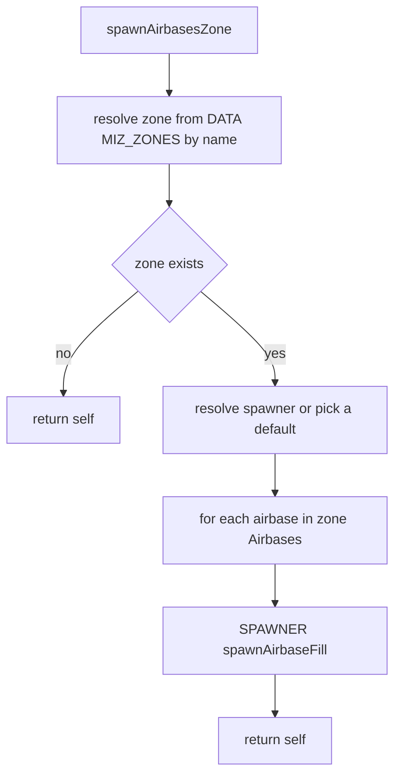
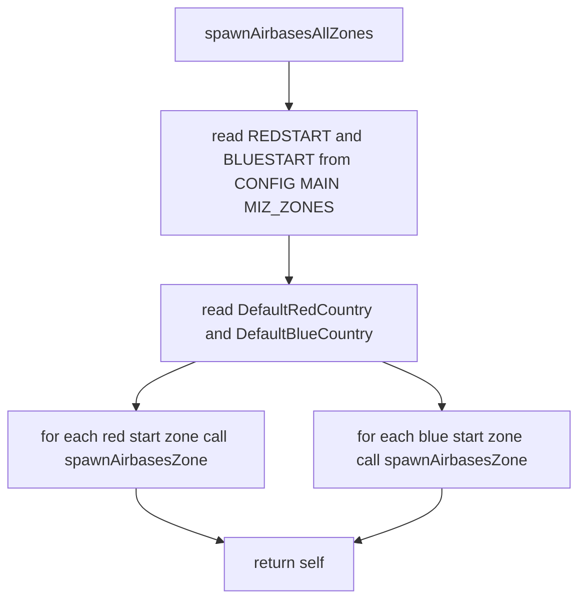
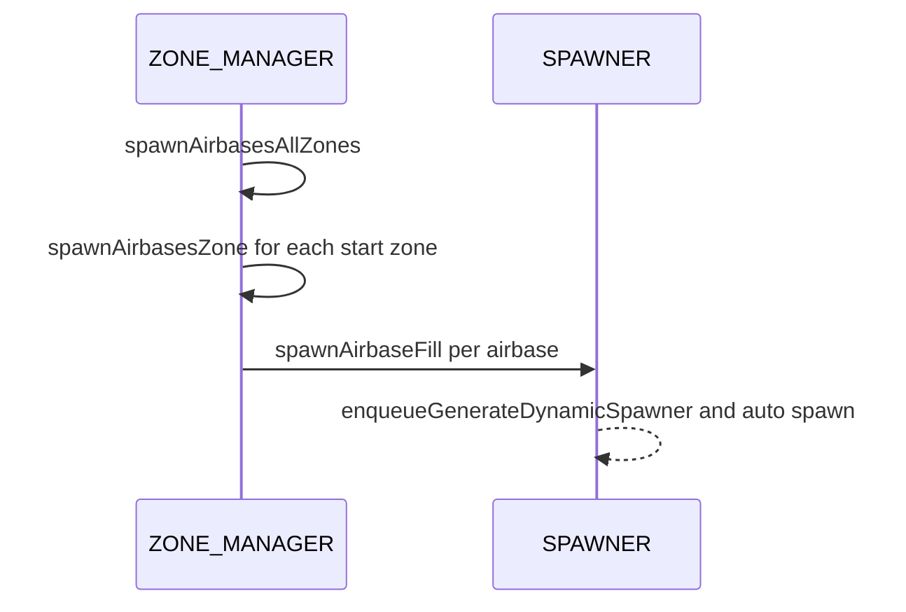

# Airbase spawns orchestration

Primary anchors:
- [AETHR.ZONE_MANAGER:spawnAirbasesZone()](../../dev/ZONE_MANAGER.lua:1125)
- [AETHR.ZONE_MANAGER:spawnAirbasesAllZones()](../../dev/ZONE_MANAGER.lua:1145)
- [AETHR.SPAWNER:spawnAirbaseFill()](../../dev/SPAWNER.lua:2169)

Related configuration:
- [AETHR.CONFIG.MAIN.MIZ_ZONES](../../dev/CONFIG_.lua:180)
- [AETHR.CONFIG.MAIN.DefaultRedCountry](../../dev/CONFIG_.lua:177)
- [AETHR.CONFIG.MAIN.DefaultBlueCountry](../../dev/CONFIG_.lua:178)

## Spawning for a single zone

Entry: [AETHR.ZONE_MANAGER:spawnAirbasesZone()](../../dev/ZONE_MANAGER.lua:1125)

Behavior:
- Resolve zone by name from DATA.MIZ_ZONES
- Choose dynamic spawner if not provided
- For each airbase in the zone, enqueue a generate and spawn job via SPAWNER

Notes:
- When dynamicSpawner is nil, a spawner is chosen from SPAWNER.DATA.dynamicSpawners.Airbase using a utilities helper; see [dev/UTILS.lua](../../dev/UTILS.lua)
- The SPAWNER call builds and enqueues generation for the airbase area: [AETHR.SPAWNER:spawnAirbaseFill()](../../dev/SPAWNER.lua:2169)

## Spawning across starter zones

Entry: [AETHR.ZONE_MANAGER:spawnAirbasesAllZones()](../../dev/ZONE_MANAGER.lua:1145)

Behavior:
- Iterate configured red starter zones and blue starter zones
- For each zone name call spawnAirbasesZone with coalition specific default country IDs

## Runtime sequence

## Naming note

The code documents a label for a function as spawnStarterAirbasesAllZones, but the exported function is named [AETHR.ZONE_MANAGER:spawnAirbasesAllZones()](../../dev/ZONE_MANAGER.lua:1145). This documentation follows the exported function name.

## Anchor index

- [AETHR.ZONE_MANAGER:spawnAirbasesZone()](../../dev/ZONE_MANAGER.lua:1125)
- [AETHR.ZONE_MANAGER:spawnAirbasesAllZones()](../../dev/ZONE_MANAGER.lua:1145)
- [AETHR.SPAWNER:spawnAirbaseFill()](../../dev/SPAWNER.lua:2169)
- [AETHR.CONFIG.MAIN.MIZ_ZONES](../../dev/CONFIG_.lua:180)
- [AETHR.CONFIG.MAIN.DefaultRedCountry](../../dev/CONFIG_.lua:177)
- [AETHR.CONFIG.MAIN.DefaultBlueCountry](../../dev/CONFIG_.lua:178)
- [dev/UTILS.lua](../../dev/UTILS.lua)