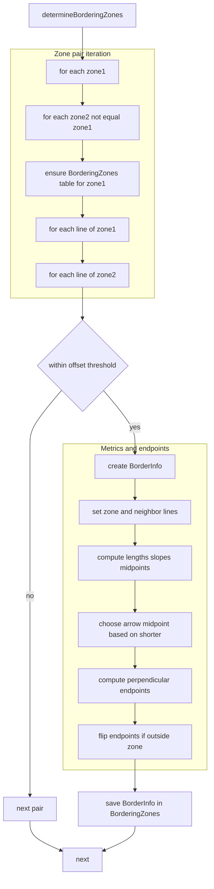
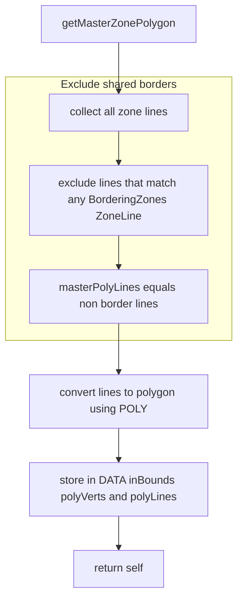
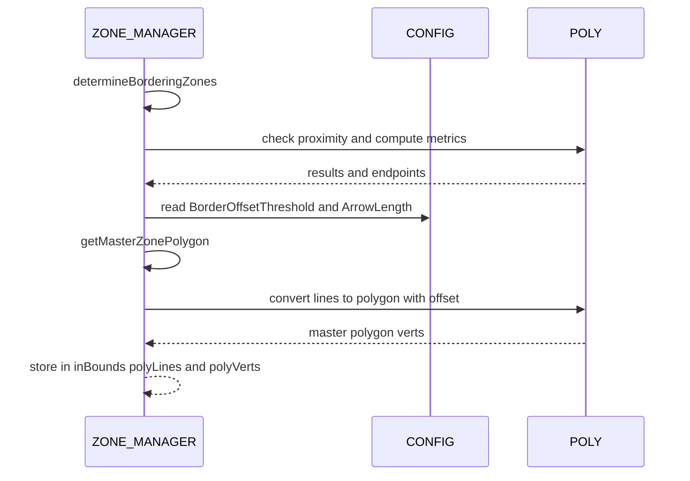

# Borders detection and master polygon construction

### This document covers:
- Bordering zone detection and border detail computation
- Master in-bounds polygon construction from non-border edges

### Primary anchors:
- [AETHR.ZONE_MANAGER:determineBorderingZones()](../../dev/ZONE_MANAGER.lua:232)
- [AETHR.ZONE_MANAGER:getMasterZonePolygon()](../../dev/ZONE_MANAGER.lua:520)

### Related configuration and geometry:
- Offset threshold and arrow length: [dev/CONFIG_.lua](../../dev/CONFIG_.lua)
  - BorderOffsetThreshold at [AETHR.CONFIG.MAIN.Zone.BorderOffsetThreshold](../../dev/CONFIG_.lua:333)
  - ArrowLength at [AETHR.CONFIG.MAIN.Zone.ArrowLength](../../dev/CONFIG_.lua:335)
- Geometry helpers used implicitly: [dev/POLY.lua](../../dev/POLY.lua)

### Notes:
- Mermaid nodes avoid double quotes and parentheses per renderer constraints.
- The border data structure is created per neighbor zone and per bordering segment.

# Bordering zone detection flow

### Entry point: [AETHR.ZONE_MANAGER:determineBorderingZones()](../../dev/ZONE_MANAGER.lua:232)

### Behavior summary:
- For each ordered pair of distinct zones, compare every line of zone1 against every line of zone2.
- Two lines are considered bordering when their distance is within zone1.BorderOffsetThreshold.
- For each border segment detected, compute zone and neighbor metrics and store an entry in MIZ_ZONES[zone1].BorderingZones[zone2].

### Key data fields set on each border detail:
- Ownership
  - OwnedByCoalition
- Zone segment metrics
  - ZoneLine
  - ZoneLineLen
  - ZoneLineMidP
  - ZoneLineSlope
  - ZoneLinePerpendicularPoint
- Neighbor segment metrics
  - NeighborLine
  - NeighborLineLen
  - NeighborLineMidP
  - NeighborLineSlope
  - NeighborLinePerpendicularPoint
- Markers
  - MarkID table for coalitions
- Arrow endpoints
  - ArrowTip
  - ArrowEnd

Clickable anchor:
- [AETHR.ZONE_MANAGER:determineBorderingZones()](../../dev/ZONE_MANAGER.lua:232)

## Arrow endpoint resolution

Within [AETHR.ZONE_MANAGER:determineBorderingZones()](../../dev/ZONE_MANAGER.lua:232), arrow endpoints are chosen by comparing segment lengths and projecting perpendicular endpoints from the midpoint of the shorter line:
- When the zone line is shorter or equal, use its midpoint as ArrowMP and set lengths based on [AETHR.CONFIG.MAIN.Zone.ArrowLength](../../dev/CONFIG_.lua:335), with neighbor perpendicular length negated.
- If the neighbor line is shorter, the logic mirrors with neighbor values.

### Safety check:
- If the computed zone perpendicular endpoint lies outside the zone polygon, the endpoints are swapped to ensure arrows point inward relative to the zone.

This ensures a consistent visual indication for border direction per coalition later used by the arrow drawing routines.

# Master polygon construction flow

### Entry point: [AETHR.ZONE_MANAGER:getMasterZonePolygon()](../../dev/ZONE_MANAGER.lua:520)

### Behavior summary:
- Aggregates all zone edges excluding edges that belong to shared borders.
- Converts the remaining set of edges into a polygon representing the master in bounds shape.

### Important details:
- The exclusion step compares by reference equality with stored border ZoneLine objects.
- Polygon conversion applies an offset parameter read from configuration:
  - [AETHR.CONFIG.MAIN.Zone.BorderOffsetThreshold](../../dev/CONFIG_.lua:333)
- Outputs are stored at:
  - DATA.GAME_BOUNDS.inBounds.polyLines
  - DATA.GAME_BOUNDS.inBounds.polyVerts

### Clickable anchor:
- [AETHR.ZONE_MANAGER:getMasterZonePolygon()](../../dev/ZONE_MANAGER.lua:520)

# Runtime sequence overview

This sequence shows how bordering detection typically precedes master polygon construction within a generation loop.

### Note:
- The exact conversion algorithm is encapsulated in POLY and not expanded here; see [dev/POLY.lua](../../dev/POLY.lua).

# Data structure overview

Per zone, BorderingZones is a map keyed by neighbor name to a list of border segments. Each segment stores both zone and neighbor line descriptors, perpendicular endpoints for arrow placement, and preallocated MarkIDs per coalition. This is populated in [AETHR.ZONE_MANAGER:determineBorderingZones()](../../dev/ZONE_MANAGER.lua:232) and later consumed by arrow initialization and drawing routines documented in markers and arrows.

Downstream consumers:
- Arrow init and draw: see [docs/zone_manager/markers_and_arrows.md](docs/zone_manager/markers_and_arrows.md)

# Anchor index

- [AETHR.ZONE_MANAGER:determineBorderingZones()](../../dev/ZONE_MANAGER.lua:232)
- [AETHR.ZONE_MANAGER:getMasterZonePolygon()](../../dev/ZONE_MANAGER.lua:520)
- [AETHR.CONFIG.MAIN.Zone.BorderOffsetThreshold](../../dev/CONFIG_.lua:333)
- [AETHR.CONFIG.MAIN.Zone.ArrowLength](../../dev/CONFIG_.lua:335)
- [dev/POLY.lua](../../dev/POLY.lua)