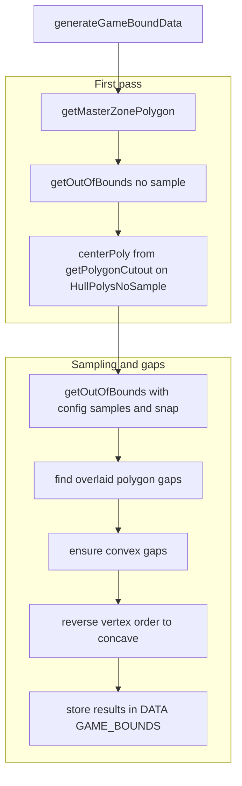
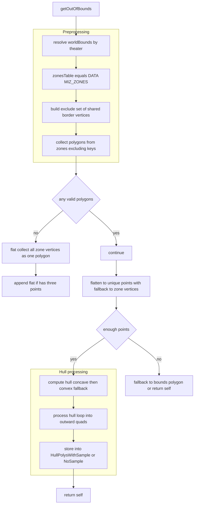
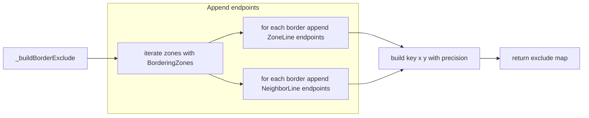
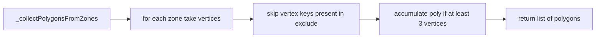
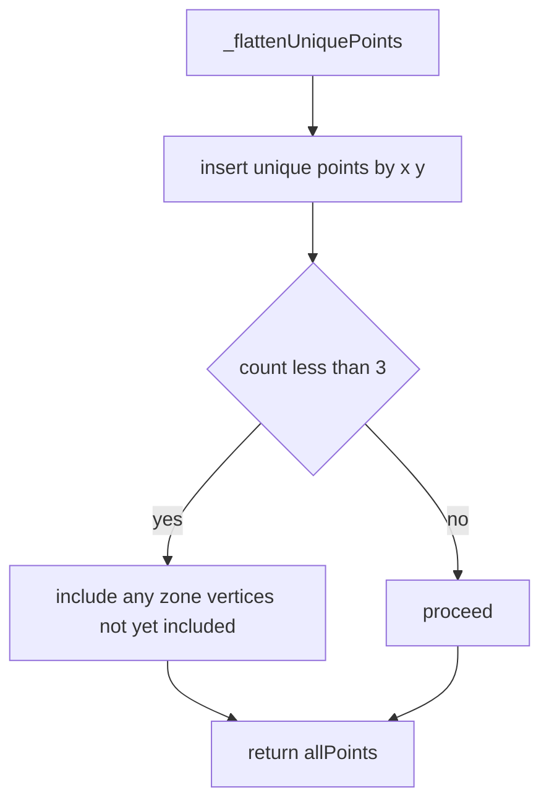
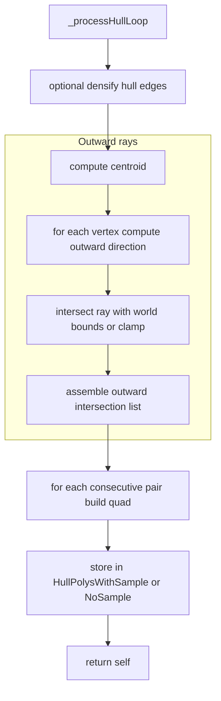
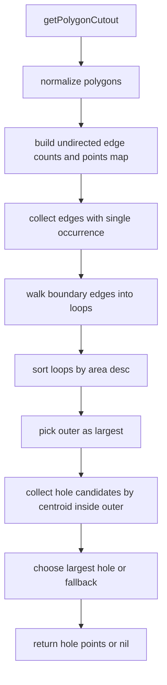

# Game bounds: master polygon, out of bounds, and gaps

### This document details the computation of:
- Master in bounds polygon from zone edges
- Out of bounds hull quads with optional densification
- Center cutout polygon and in–out gap polygons

### Primary anchors:
- [AETHR.ZONE_MANAGER:getOutOfBounds()](https://github.com/Gh0st352/AETHR/blob/main/dev/ZONE_MANAGER.lua#L799)
- [AETHR.ZONE_MANAGER:_buildBorderExclude()](https://github.com/Gh0st352/AETHR/blob/main/dev/ZONE_MANAGER.lua#L356)
- [AETHR.ZONE_MANAGER:_collectPolygonsFromZones()](https://github.com/Gh0st352/AETHR/blob/main/dev/ZONE_MANAGER.lua#L385)
- [AETHR.ZONE_MANAGER:_flattenUniquePoints()](https://github.com/Gh0st352/AETHR/blob/main/dev/ZONE_MANAGER.lua#L410)
- [AETHR.ZONE_MANAGER:_processHullLoop()](https://github.com/Gh0st352/AETHR/blob/main/dev/ZONE_MANAGER.lua#L449)
- [AETHR.ZONE_MANAGER:getPolygonCutout()](https://github.com/Gh0st352/AETHR/blob/main/dev/ZONE_MANAGER.lua#L565)
- [AETHR.ZONE_MANAGER:generateGameBoundData()](https://github.com/Gh0st352/AETHR/blob/main/dev/ZONE_MANAGER.lua#L895)

### Related dependencies:
- [dev/CONFIG_.lua](../../dev/CONFIG_.lua)
- [dev/POLY.lua](../../dev/POLY.lua)

# End to end pipeline

Entry point: [AETHR.ZONE_MANAGER:generateGameBoundData()](https://github.com/Gh0st352/AETHR/blob/main/dev/ZONE_MANAGER.lua#L895)

### Outputs stored in:
- DATA.GAME_BOUNDS.outOfBounds.HullPolysNoSample
- DATA.GAME_BOUNDS.outOfBounds.HullPolysWithSample
- DATA.GAME_BOUNDS.outOfBounds.centerPoly
- DATA.GAME_BOUNDS.inBounds.polyLines and polyVerts
- DATA.GAME_BOUNDS.inOutBoundsGaps.overlaid, .convex, .concave

# Computing out of bounds hull tiles

### Entry point: [AETHR.ZONE_MANAGER:getOutOfBounds()](https://github.com/Gh0st352/AETHR/blob/main/dev/ZONE_MANAGER.lua#L799)

### Behavior summary:
- Resolve world bounds from configuration
- Build exclude set of shared border vertices
- Collect zone polygons after excluding border vertices
- Fallback to a flat vertex set when polygons are invalid
- Build unique points and compute hull
- Process hull loop into outward quads and store

### Key helpers:
- Exclude set: [AETHR.ZONE_MANAGER:_buildBorderExclude()](https://github.com/Gh0st352/AETHR/blob/main/dev/ZONE_MANAGER.lua#L356)
- Collect polygons: [AETHR.ZONE_MANAGER:_collectPolygonsFromZones()](https://github.com/Gh0st352/AETHR/blob/main/dev/ZONE_MANAGER.lua#L385)
- Unique points: [AETHR.ZONE_MANAGER:_flattenUniquePoints()](https://github.com/Gh0st352/AETHR/blob/main/dev/ZONE_MANAGER.lua#L410)
- Hull processing: [AETHR.ZONE_MANAGER:_processHullLoop()](https://github.com/Gh0st352/AETHR/blob/main/dev/ZONE_MANAGER.lua#L449)
- Geometry hulls and bounds conversion: [dev/POLY.lua](../../dev/POLY.lua)

# Excluding shared border vertices

### Entry point: [AETHR.ZONE_MANAGER:_buildBorderExclude()](https://github.com/Gh0st352/AETHR/blob/main/dev/ZONE_MANAGER.lua#L356)

### Purpose:
- Prevents shared edges from contributing to the master perimeter hull by removing their endpoints from candidate polygons

# Collecting polygons after exclude

### Entry point: [AETHR.ZONE_MANAGER:_collectPolygonsFromZones()](https://github.com/Gh0st352/AETHR/blob/main/dev/ZONE_MANAGER.lua#L385)

# Flattening to unique points

### Entry point: [AETHR.ZONE_MANAGER:_flattenUniquePoints()](https://github.com/Gh0st352/AETHR/blob/main/dev/ZONE_MANAGER.lua#L410)

# Hull loop to outward quads

### Entry point: [AETHR.ZONE_MANAGER:_processHullLoop()](https://github.com/Gh0st352/AETHR/blob/main/dev/ZONE_MANAGER.lua#L449)

### Behavior summary:
- Optional densification of hull edges using samples and snapping
- Compute centroid of the hull
- For each hull vertex, cast outward ray to world bounds and capture intersection
- Form quads between consecutive hull vertices and their outward intersections
- Store the resulting list depending on whether sampling was enabled

### Geometry dependencies:
- Densify edges, centroid, bounds intersection: [dev/POLY.lua](../../dev/POLY.lua)

# Center cutout polygon

### Entry point: [AETHR.ZONE_MANAGER:getPolygonCutout()](https://github.com/Gh0st352/AETHR/blob/main/dev/ZONE_MANAGER.lua#L565)

### Behavior summary:
- Normalize input polygons to a canonical point form
- Build undirected edge counts
- Boundary edges are those seen once
- Walk boundary edges to form closed loops
- Outer loop is largest area; holes are loops whose centroid lies inside the outer
- Return the largest hole loop or fallback to second largest

# Configuration inputs

- Theater bounds used by out of bounds:
  - [AETHR.CONFIG.MAIN.worldBounds](https://github.com/Gh0st352/AETHR/blob/main/dev/CONFIG_.lua#L245)
- Game bounds rendering and sampling configuration:
  - [AETHR.CONFIG.MAIN.Zone.gameBounds.getOutOfBounds.samplesPerEdge](https://github.com/Gh0st352/AETHR/blob/main/dev/CONFIG_.lua#L327)
  - [AETHR.CONFIG.MAIN.Zone.gameBounds.getOutOfBounds.useHoleSinglePolygon](https://github.com/Gh0st352/AETHR/blob/main/dev/CONFIG_.lua#L329)
  - [AETHR.CONFIG.MAIN.Zone.gameBounds.getOutOfBounds.snapDistance](https://github.com/Gh0st352/AETHR/blob/main/dev/CONFIG_.lua#L330)
- Line and fill colors for game bounds markers:
  - [AETHR.CONFIG.MAIN.Zone.gameBounds.LineColors](https://github.com/Gh0st352/AETHR/blob/main/dev/CONFIG_.lua#L322)
  - [AETHR.CONFIG.MAIN.Zone.gameBounds.FillColors](https://github.com/Gh0st352/AETHR/blob/main/dev/CONFIG_.lua#L323)
  - [AETHR.CONFIG.MAIN.Zone.gameBounds.LineAlpha](https://github.com/Gh0st352/AETHR/blob/main/dev/CONFIG_.lua#L325)
  - [AETHR.CONFIG.MAIN.Zone.gameBounds.FillAlpha](https://github.com/Gh0st352/AETHR/blob/main/dev/CONFIG_.lua#L324)
  - [AETHR.CONFIG.MAIN.Zone.gameBounds.lineType](https://github.com/Gh0st352/AETHR/blob/main/dev/CONFIG_.lua#L326)

# Anchor index

- [AETHR.ZONE_MANAGER:generateGameBoundData()](https://github.com/Gh0st352/AETHR/blob/main/dev/ZONE_MANAGER.lua#L895)
- [AETHR.ZONE_MANAGER:getOutOfBounds()](https://github.com/Gh0st352/AETHR/blob/main/dev/ZONE_MANAGER.lua#L799)
- [AETHR.ZONE_MANAGER:_buildBorderExclude()](https://github.com/Gh0st352/AETHR/blob/main/dev/ZONE_MANAGER.lua#L356)
- [AETHR.ZONE_MANAGER:_collectPolygonsFromZones()](https://github.com/Gh0st352/AETHR/blob/main/dev/ZONE_MANAGER.lua#L385)
- [AETHR.ZONE_MANAGER:_flattenUniquePoints()](https://github.com/Gh0st352/AETHR/blob/main/dev/ZONE_MANAGER.lua#L410)
- [AETHR.ZONE_MANAGER:_processHullLoop()](https://github.com/Gh0st352/AETHR/blob/main/dev/ZONE_MANAGER.lua#L449)
- [AETHR.ZONE_MANAGER:getPolygonCutout()](https://github.com/Gh0st352/AETHR/blob/main/dev/ZONE_MANAGER.lua#L565)
- [dev/POLY.lua](../../dev/POLY.lua)
- [dev/CONFIG_.lua](../../dev/CONFIG_.lua)