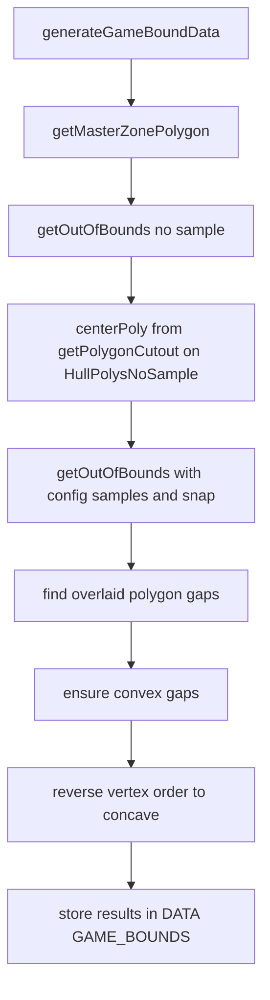
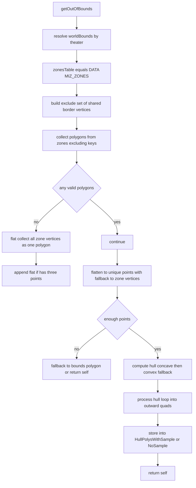
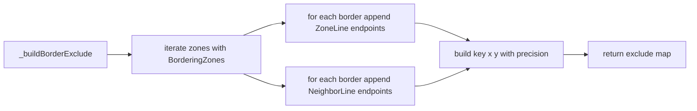
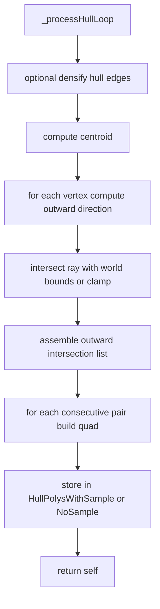

# Game bounds: master polygon, out of bounds, and gaps

This document details the computation of:
- Master in bounds polygon from zone edges
- Out of bounds hull quads with optional densification
- Center cutout polygon and in–out gap polygons

Primary anchors:
- [AETHR.ZONE_MANAGER:getOutOfBounds()](../../dev/ZONE_MANAGER.lua:799)
- [AETHR.ZONE_MANAGER:_buildBorderExclude()](../../dev/ZONE_MANAGER.lua:356)
- [AETHR.ZONE_MANAGER:_collectPolygonsFromZones()](../../dev/ZONE_MANAGER.lua:385)
- [AETHR.ZONE_MANAGER:_flattenUniquePoints()](../../dev/ZONE_MANAGER.lua:410)
- [AETHR.ZONE_MANAGER:_processHullLoop()](../../dev/ZONE_MANAGER.lua:449)
- [AETHR.ZONE_MANAGER:getPolygonCutout()](../../dev/ZONE_MANAGER.lua:565)
- [AETHR.ZONE_MANAGER:generateGameBoundData()](../../dev/ZONE_MANAGER.lua:895)

Related dependencies:
- [dev/CONFIG_.lua](../../dev/CONFIG_.lua)
- [dev/POLY.lua](../../dev/POLY.lua)

## End to end pipeline

Entry point: [AETHR.ZONE_MANAGER:generateGameBoundData()](../../dev/ZONE_MANAGER.lua:895)

Outputs stored in:
- DATA.GAME_BOUNDS.outOfBounds.HullPolysNoSample
- DATA.GAME_BOUNDS.outOfBounds.HullPolysWithSample
- DATA.GAME_BOUNDS.outOfBounds.centerPoly
- DATA.GAME_BOUNDS.inBounds.polyLines and polyVerts
- DATA.GAME_BOUNDS.inOutBoundsGaps.overlaid, .convex, .concave

## Computing out of bounds hull tiles

Entry point: [AETHR.ZONE_MANAGER:getOutOfBounds()](../../dev/ZONE_MANAGER.lua:799)

Behavior summary:
- Resolve world bounds from configuration
- Build exclude set of shared border vertices
- Collect zone polygons after excluding border vertices
- Fallback to a flat vertex set when polygons are invalid
- Build unique points and compute hull
- Process hull loop into outward quads and store

Key helpers:
- Exclude set: [AETHR.ZONE_MANAGER:_buildBorderExclude()](../../dev/ZONE_MANAGER.lua:356)
- Collect polygons: [AETHR.ZONE_MANAGER:_collectPolygonsFromZones()](../../dev/ZONE_MANAGER.lua:385)
- Unique points: [AETHR.ZONE_MANAGER:_flattenUniquePoints()](../../dev/ZONE_MANAGER.lua:410)
- Hull processing: [AETHR.ZONE_MANAGER:_processHullLoop()](../../dev/ZONE_MANAGER.lua:449)
- Geometry hulls and bounds conversion: [dev/POLY.lua](../../dev/POLY.lua)

## Excluding shared border vertices

Entry point: [AETHR.ZONE_MANAGER:_buildBorderExclude()](../../dev/ZONE_MANAGER.lua:356)

Purpose:
- Prevents shared edges from contributing to the master perimeter hull by removing their endpoints from candidate polygons

## Collecting polygons after exclude

Entry point: [AETHR.ZONE_MANAGER:_collectPolygonsFromZones()](../../dev/ZONE_MANAGER.lua:385)

## Flattening to unique points

Entry point: [AETHR.ZONE_MANAGER:_flattenUniquePoints()](../../dev/ZONE_MANAGER.lua:410)

## Hull loop to outward quads

Entry point: [AETHR.ZONE_MANAGER:_processHullLoop()](../../dev/ZONE_MANAGER.lua:449)

Behavior summary:
- Optional densification of hull edges using samples and snapping
- Compute centroid of the hull
- For each hull vertex, cast outward ray to world bounds and capture intersection
- Form quads between consecutive hull vertices and their outward intersections
- Store the resulting list depending on whether sampling was enabled

Geometry dependencies:
- Densify edges, centroid, bounds intersection: [dev/POLY.lua](../../dev/POLY.lua)

## Center cutout polygon

Entry point: [AETHR.ZONE_MANAGER:getPolygonCutout()](../../dev/ZONE_MANAGER.lua:565)

Behavior summary:
- Normalize input polygons to a canonical point form
- Build undirected edge counts
- Boundary edges are those seen once
- Walk boundary edges to form closed loops
- Outer loop is largest area; holes are loops whose centroid lies inside the outer
- Return the largest hole loop or fallback to second largest

## Configuration inputs

- Theater bounds used by out of bounds:
  - [AETHR.CONFIG.MAIN.worldBounds](../../dev/CONFIG_.lua:245)
- Game bounds rendering and sampling configuration:
  - [AETHR.CONFIG.MAIN.Zone.gameBounds.getOutOfBounds.samplesPerEdge](../../dev/CONFIG_.lua:327)
  - [AETHR.CONFIG.MAIN.Zone.gameBounds.getOutOfBounds.useHoleSinglePolygon](../../dev/CONFIG_.lua:329)
  - [AETHR.CONFIG.MAIN.Zone.gameBounds.getOutOfBounds.snapDistance](../../dev/CONFIG_.lua:330)
- Line and fill colors for game bounds markers:
  - [AETHR.CONFIG.MAIN.Zone.gameBounds.LineColors](../../dev/CONFIG_.lua:322)
  - [AETHR.CONFIG.MAIN.Zone.gameBounds.FillColors](../../dev/CONFIG_.lua:323)
  - [AETHR.CONFIG.MAIN.Zone.gameBounds.LineAlpha](../../dev/CONFIG_.lua:325)
  - [AETHR.CONFIG.MAIN.Zone.gameBounds.FillAlpha](../../dev/CONFIG_.lua:324)
  - [AETHR.CONFIG.MAIN.Zone.gameBounds.lineType](../../dev/CONFIG_.lua:326)

## Anchor index

- [AETHR.ZONE_MANAGER:generateGameBoundData()](../../dev/ZONE_MANAGER.lua:895)
- [AETHR.ZONE_MANAGER:getOutOfBounds()](../../dev/ZONE_MANAGER.lua:799)
- [AETHR.ZONE_MANAGER:_buildBorderExclude()](../../dev/ZONE_MANAGER.lua:356)
- [AETHR.ZONE_MANAGER:_collectPolygonsFromZones()](../../dev/ZONE_MANAGER.lua:385)
- [AETHR.ZONE_MANAGER:_flattenUniquePoints()](../../dev/ZONE_MANAGER.lua:410)
- [AETHR.ZONE_MANAGER:_processHullLoop()](../../dev/ZONE_MANAGER.lua:449)
- [AETHR.ZONE_MANAGER:getPolygonCutout()](../../dev/ZONE_MANAGER.lua:565)
- [dev/POLY.lua](../../dev/POLY.lua)
- [dev/CONFIG_.lua](../../dev/CONFIG_.lua)