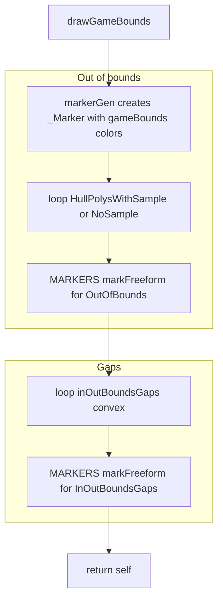
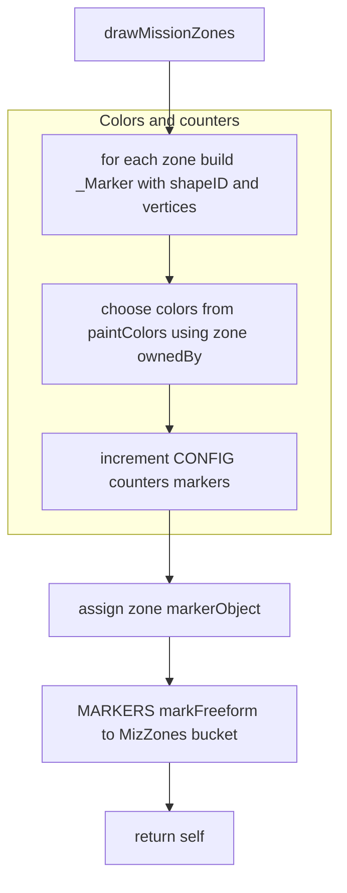
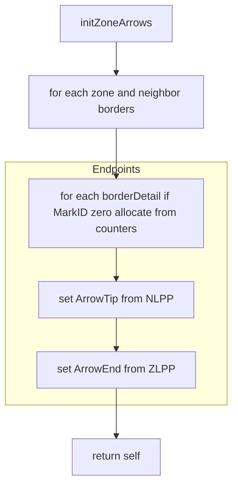
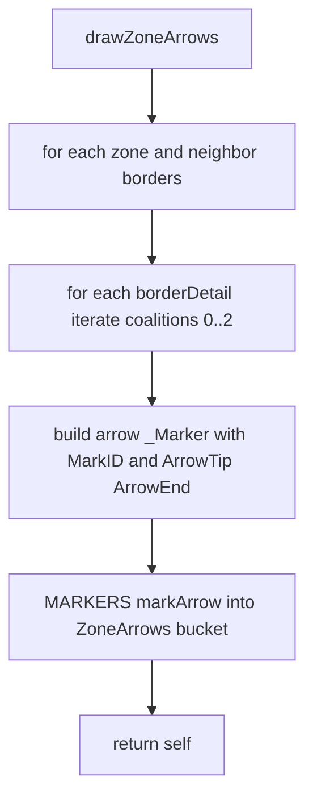
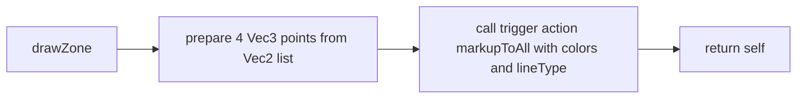
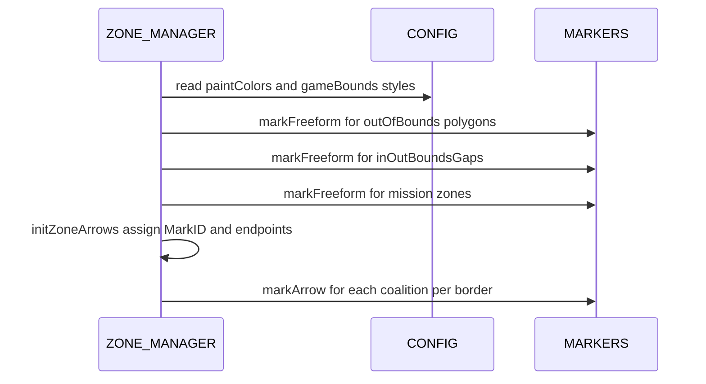

# Markers and arrows rendering

This document covers how mission zones, game bounds, and border-direction arrows are rendered.

### Primary anchors:
- [AETHR.ZONE_MANAGER:drawGameBounds()](https://github.com/Gh0st352/AETHR/blob/main/dev/ZONE_MANAGER.lua#L931)
- [AETHR.ZONE_MANAGER:drawMissionZones()](https://github.com/Gh0st352/AETHR/blob/main/dev/ZONE_MANAGER.lua#L980)
- [AETHR.ZONE_MANAGER:initZoneArrows()](https://github.com/Gh0st352/AETHR/blob/main/dev/ZONE_MANAGER.lua#L1075)
- [AETHR.ZONE_MANAGER:drawZoneArrows()](https://github.com/Gh0st352/AETHR/blob/main/dev/ZONE_MANAGER.lua#L1025)
- [AETHR.ZONE_MANAGER:drawZone()](https://github.com/Gh0st352/AETHR/blob/main/dev/ZONE_MANAGER.lua#L329)

### Related modules:
- Marker helpers: [dev/MARKERS.lua](../../dev/MARKERS.lua)
- Config colors and line styles: [dev/CONFIG_.lua](../../dev/CONFIG_.lua)
- Enum types: [dev/ENUMS.lua](../../dev/ENUMS.lua)

# Rendering game bounds polygons

### Entry: [AETHR.ZONE_MANAGER:drawGameBounds()](https://github.com/Gh0st352/AETHR/blob/main/dev/ZONE_MANAGER.lua#L931)

### Behavior:
- Builds a marker descriptor for each polygon in either HullPolysWithSample or HullPolysNoSample.
- Increments global marker counter per marker.
- Uses MARKERS to render as freeform.

### Configuration fields:
- Colors and line style: 
  - [AETHR.CONFIG.MAIN.Zone.gameBounds.LineColors](https://github.com/Gh0st352/AETHR/blob/main/dev/CONFIG_.lua#L322)
  - [AETHR.CONFIG.MAIN.Zone.gameBounds.FillColors](https://github.com/Gh0st352/AETHR/blob/main/dev/CONFIG_.lua#L323)
  - [AETHR.CONFIG.MAIN.Zone.gameBounds.FillAlpha](https://github.com/Gh0st352/AETHR/blob/main/dev/CONFIG_.lua#L324)
  - [AETHR.CONFIG.MAIN.Zone.gameBounds.LineAlpha](https://github.com/Gh0st352/AETHR/blob/main/dev/CONFIG_.lua#L325)
  - [AETHR.CONFIG.MAIN.Zone.gameBounds.lineType](https://github.com/Gh0st352/AETHR/blob/main/dev/CONFIG_.lua#L326)

# Rendering mission zones

### Entry: [AETHR.ZONE_MANAGER:drawMissionZones()](https://github.com/Gh0st352/AETHR/blob/main/dev/ZONE_MANAGER.lua#L980)

### Behavior:
- Creates a _Marker per zone using coalition keyed paint colors.
- Stores markerObject on the zone for potential updates elsewhere.
- Renders via MARKERS markFreeform.

### Configuration fields:
- [AETHR.CONFIG.MAIN.Zone.paintColors.LineColors](https://github.com/Gh0st352/AETHR/blob/main/dev/CONFIG_.lua#L297)
- [AETHR.CONFIG.MAIN.Zone.paintColors.FillColors](https://github.com/Gh0st352/AETHR/blob/main/dev/CONFIG_.lua#L302)
- [AETHR.CONFIG.MAIN.Zone.paintColors.ArrowColors](https://github.com/Gh0st352/AETHR/blob/main/dev/CONFIG_.lua#L307)
- [AETHR.CONFIG.MAIN.Zone.paintColors.FillAlpha](https://github.com/Gh0st352/AETHR/blob/main/dev/CONFIG_.lua#L317)
- [AETHR.CONFIG.MAIN.Zone.paintColors.LineAlpha](https://github.com/Gh0st352/AETHR/blob/main/dev/CONFIG_.lua#L318)
- [AETHR.CONFIG.MAIN.Zone.paintColors.lineType](https://github.com/Gh0st352/AETHR/blob/main/dev/CONFIG_.lua#L319)

# Initializing arrow markers

### Entry: [AETHR.ZONE_MANAGER:initZoneArrows()](https://github.com/Gh0st352/AETHR/blob/main/dev/ZONE_MANAGER.lua#L1075)

### Behavior:
- For every border segment on every zone, assigns MarkID for all coalitions if missing.
- Derives ArrowTip and ArrowEnd from border perpendicular endpoints computed during bordering detection.

### Notes:
- NLPP equals NeighborLinePerpendicularPoint
- ZLPP equals ZoneLinePerpendicularPoint
- These endpoints are computed in bordering detection and adjusted to lie inside the zone; see [docs/zone_manager/borders_and_master.md](docs/zone_manager/borders_and_master.md)

# Drawing arrow markers

### Entry: [AETHR.ZONE_MANAGER:drawZoneArrows()](https://github.com/Gh0st352/AETHR/blob/main/dev/ZONE_MANAGER.lua#L1025)

### Behavior:
- For each border segment, for each coalition from 0 to 2, builds an arrow _Marker using ArrowColors.
- Calls MARKERS markArrow to render.

### Configuration fields:
- Arrow colors by coalition: [AETHR.CONFIG.MAIN.Zone.paintColors.ArrowColors](https://github.com/Gh0st352/AETHR/blob/main/dev/CONFIG_.lua#L307)
- Line style used here: [AETHR.ENUMS.LineTypes.Solid](../../dev/ENUMS.lua)

# Drawing a raw polygon shape on F10

### Entry: [AETHR.ZONE_MANAGER:drawZone()](https://github.com/Gh0st352/AETHR/blob/main/dev/ZONE_MANAGER.lua#L329)

### Behavior:
- Sends a polygon draw command via trigger.action.markupToAll using four Vec3 points.
- Parameters include coalition, fill and border colors, and line type.

### Use cases:
- Ad hoc debug polygons or legacy flows outside the freeform marker system.

# Runtime sequence overview

### Downstream updates:
- Zone color updates and arrow visibility changes can be applied by WORLD reactions to ownership changes; see watchers documentation.

# Anchor index

- [AETHR.ZONE_MANAGER:drawGameBounds()](https://github.com/Gh0st352/AETHR/blob/main/dev/ZONE_MANAGER.lua#L931)
- [AETHR.ZONE_MANAGER:drawMissionZones()](https://github.com/Gh0st352/AETHR/blob/main/dev/ZONE_MANAGER.lua#L980)
- [AETHR.ZONE_MANAGER:initZoneArrows()](https://github.com/Gh0st352/AETHR/blob/main/dev/ZONE_MANAGER.lua#L1075)
- [AETHR.ZONE_MANAGER:drawZoneArrows()](https://github.com/Gh0st352/AETHR/blob/main/dev/ZONE_MANAGER.lua#L1025)
- [AETHR.ZONE_MANAGER:drawZone()](https://github.com/Gh0st352/AETHR/blob/main/dev/ZONE_MANAGER.lua#L329)
- [dev/MARKERS.lua](../../dev/MARKERS.lua)
- [dev/CONFIG_.lua](../../dev/CONFIG_.lua)
- [dev/ENUMS.lua](../../dev/ENUMS.lua)