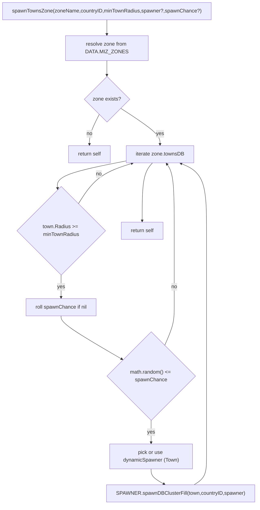
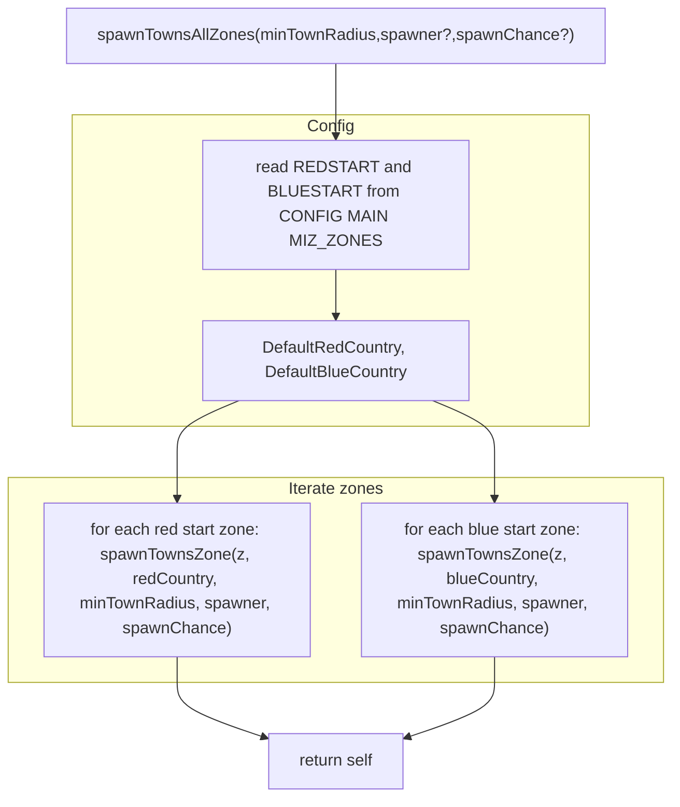

# Town spawns: per-zone and all-zones

This document explains how town filler groups are spawned via ZONE_MANAGER using SPAWNER's DB cluster helper.

### Primary anchors
- [AETHR.ZONE_MANAGER:spawnTownsZone()](https://github.com/Gh0st352/AETHR/blob/main/dev/ZONE_MANAGER.lua#L1169)
- [AETHR.ZONE_MANAGER:spawnTownsAllZones()](https://github.com/Gh0st352/AETHR/blob/main/dev/ZONE_MANAGER.lua#L1214)
- [AETHR.ZONE_MANAGER:pairTowns()](https://github.com/Gh0st352/AETHR/blob/main/dev/ZONE_MANAGER.lua#L183)
- [AETHR.SPAWNER:spawnDBClusterFill()](https://github.com/Gh0st352/AETHR/blob/main/dev/SPAWNER.lua#L2184)
- [AETHR.SPAWNER:enqueueGenerateDynamicSpawner()](https://github.com/Gh0st352/AETHR/blob/main/dev/SPAWNER.lua#L520)
- [WORLD towns clustering](../world/towns.md)
- [CONFIG defaults: DefaultRedCountry / DefaultBlueCountry](https://github.com/Gh0st352/AETHR/blob/main/dev/CONFIG_.lua#L177)
- Last updated: 2025-10-19

### Preconditions
- ZONE_MANAGER has populated [DATA.MIZ_ZONES](../zone_manager/zone_data.md) and paired towns via [pairTowns](https://github.com/Gh0st352/AETHR/blob/main/dev/ZONE_MANAGER.lua#L183).
- WORLD has town clusters available; see [docs/world/towns.md](../world/towns.md).
- SPAWNER has at least one dynamic spawner registered under type "Town" (in [SPAWNER.DATA.dynamicSpawners.Town](../spawner/README.md)) or you pass one explicitly.

# Per-zone flow

Entry: [AETHR.ZONE_MANAGER:spawnTownsZone()](https://github.com/Gh0st352/AETHR/blob/main/dev/ZONE_MANAGER.lua#L1169)



# All-zones flow

Entry: [AETHR.ZONE_MANAGER:spawnTownsAllZones()](https://github.com/Gh0st352/AETHR/blob/main/dev/ZONE_MANAGER.lua#L1214)



# Runtime sequence (enqueue to world spawn)


# Determinism and controls

- spawnDBClusterFill enqueues jobs with autoSpawn set; generation itself can be deterministic when a seed is provided on the dynamic spawner and determinism is enabled. See:
  - [AETHR.SPAWNER:generateDynamicSpawner()](https://github.com/Gh0st352/AETHR/blob/main/dev/SPAWNER.lua#L563) and [AETHR.UTILS:withSeed()](https://github.com/Gh0st352/AETHR/blob/main/dev/UTILS.lua#L242)
  - SPAWNER deterministic config fields (Enabled, Warmup, ReseedAfter) in [SPAWNER.DATA.CONFIG.Deterministic](https://github.com/Gh0st352/AETHR/blob/main/dev/SPAWNER.lua#L103)

# Notes and guardrails

- minTownRadius filters out small clusters; use WORLD towns docs to understand radius meanings.
- spawnChance defaults to a random draw per town when nil; pass an explicit 0..1 to control density.
- When spawner is nil, one is chosen from SPAWNER.DATA.dynamicSpawners.Town using utilities.
- Countries: for all-zones flow, sides use CONFIG defaults; for per-zone, pass countryID explicitly.
- Placement respects NOGO surfaces and optional restricted polygons; see [SPAWNER NOGO](../spawner/nogo.md).

# Example

Lua (inside mission setup or script):

```lua
-- Ensure towns are paired
AETHR.ZONE_MANAGER:pairTowns()

-- Spawn towns across configured starter zones, radius >= 500m, 50% chance
local minTownRadius = 500
local spawnChance = 0.5
AETHR.ZONE_MANAGER:spawnTownsAllZones(minTownRadius, nil, spawnChance)
```

# Cross-links

- Airbases: [zone_manager/airbases.md](./airbases.md)
- WORLD towns: [world/towns.md](../world/towns.md)
- SPAWNER helpers: [spawner/auxiliary.md](../spawner/auxiliary.md)