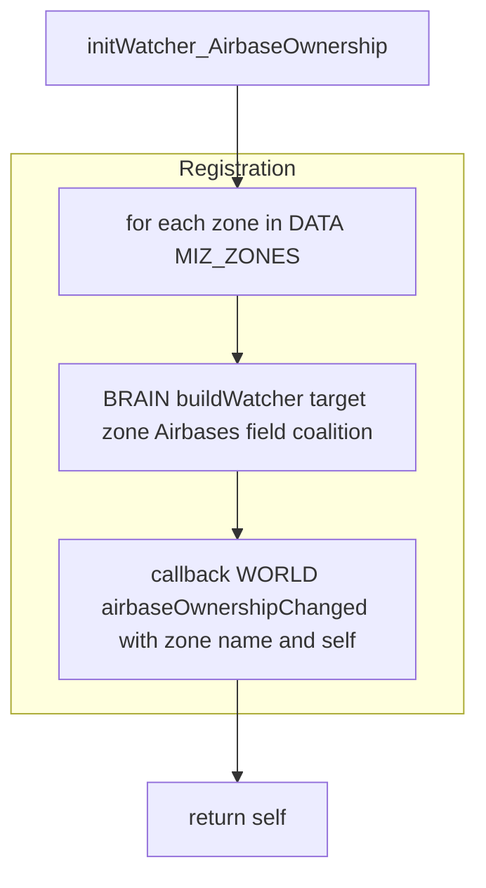

# Watchers: reacting to ownership changes

This document covers watchers that observe changes in airbase coalition and zone ownership, wiring them to WORLD callbacks via BRAIN utilities.

### Primary anchors:
- [AETHR.ZONE_MANAGER:initWatcher_AirbaseOwnership()](../../dev/ZONE_MANAGER.lua:1103)
- [AETHR.ZONE_MANAGER:initWatcher_ZoneOwnership()](../../dev/ZONE_MANAGER.lua:1113)

### Related modules:
- BRAIN watcher utilities: [AETHR.BRAIN:buildWatcher()](../../dev/BRAIN.lua:242)
- WORLD callbacks and reactions: [dev/WORLD.lua](../../dev/WORLD.lua)

# Airbase coalition ownership watcher

### Entry: [AETHR.ZONE_MANAGER:initWatcher_AirbaseOwnership()](../../dev/ZONE_MANAGER.lua:1103)

### Behavior:
- Iterates all MIZ zones
- For each zone, registers a watcher on the zone.Airbases collection for the field coalition
- The watcher triggers WORLD.airbaseOwnershipChanged with zone name and module context

### Notes:
- buildWatcher is used as the wiring mechanism in BRAIN
- WORLD is expected to handle updates such as recoloring or reassigning spawns after coalition change

# Zone ownership watcher

### Entry: [AETHR.ZONE_MANAGER:initWatcher_ZoneOwnership()](../../dev/ZONE_MANAGER.lua:1113)

### Behavior:
- Registers a watcher across the MIZ_ZONES table for field ownedBy
- The watcher triggers WORLD.zoneOwnershipChanged with module context

### Typical downstream reactions in WORLD may include:
- Updating zone colors and arrow colors by coalition
- Showing outText notifications using CONFIG settings
- Triggering spawns or despawns when ownership flips

# Runtime sequence overview

### Configuration references:
- OutText display settings may be used by WORLD handlers
  - [AETHR.CONFIG.MAIN.outTextSettings](../../dev/CONFIG_.lua:336)

# Anchor index

- [AETHR.ZONE_MANAGER:initWatcher_AirbaseOwnership()](../../dev/ZONE_MANAGER.lua:1103)
- [AETHR.ZONE_MANAGER:initWatcher_ZoneOwnership()](../../dev/ZONE_MANAGER.lua:1113)
- [AETHR.BRAIN:buildWatcher()](../../dev/BRAIN.lua:242)
- [dev/WORLD.lua](../../dev/WORLD.lua)
- [dev/CONFIG_.lua](../../dev/CONFIG_.lua)