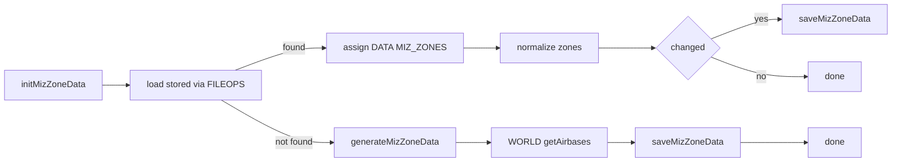
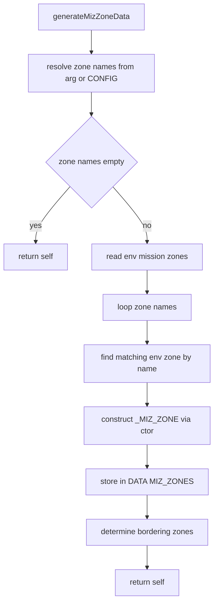
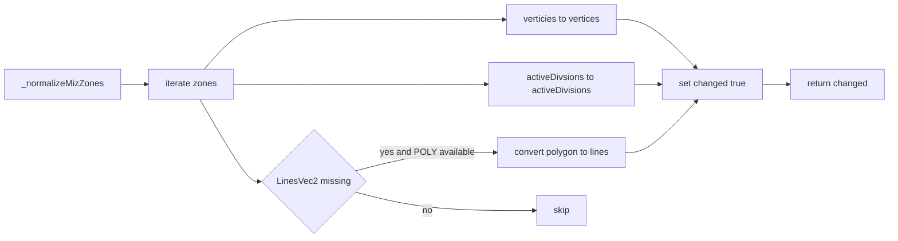
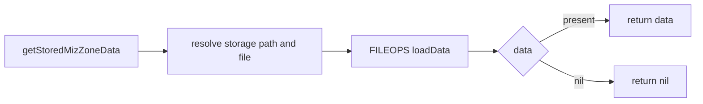
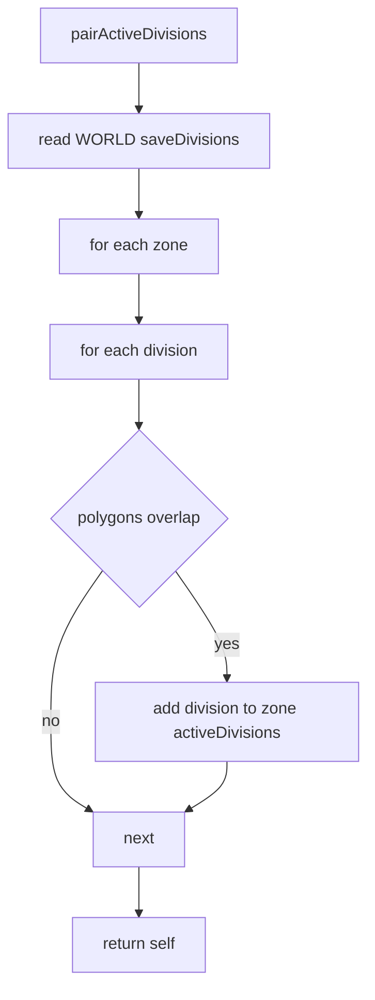
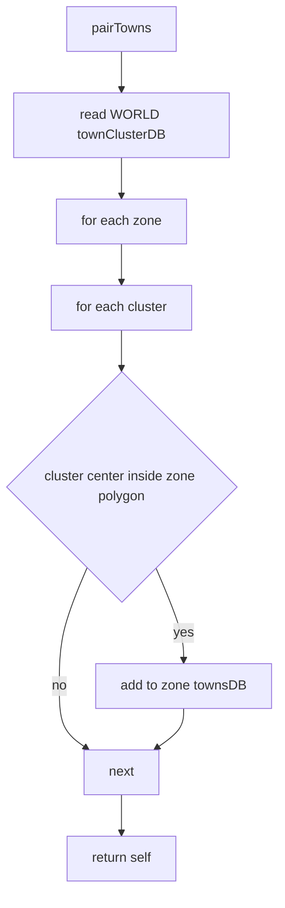

# Zone data lifecycle and normalization

This document captures the end-to-end data flows for mission trigger zones managed by [dev/ZONE_MANAGER.lua](dev/ZONE_MANAGER.lua), with clickable anchors to the core logic:
- [AETHR.ZONE_MANAGER:initMizZoneData()](dev/ZONE_MANAGER.lua:122)
- [AETHR.ZONE_MANAGER:getStoredMizZoneData()](dev/ZONE_MANAGER.lua:141)
- [AETHR.ZONE_MANAGER:saveMizZoneData()](dev/ZONE_MANAGER.lua:152)
- [AETHR.ZONE_MANAGER:generateMizZoneData()](dev/ZONE_MANAGER.lua:205)
- [AETHR.ZONE_MANAGER:_normalizeMizZones()](dev/ZONE_MANAGER.lua:53)
- [AETHR.ZONE_MANAGER:pairActiveDivisions()](dev/ZONE_MANAGER.lua:161)
- [AETHR.ZONE_MANAGER:pairTowns()](dev/ZONE_MANAGER.lua:182)

Related dependencies:
- [dev/CONFIG_.lua](dev/CONFIG_.lua)
- [dev/FILEOPS_.lua](dev/FILEOPS_.lua)
- [dev/WORLD.lua](dev/WORLD.lua)
- [dev/POLY.lua](dev/POLY.lua)

Notes:
- All bracket labels in diagrams avoid double quotes and parentheses for Mermaid compatibility.

## Initialization flow

Entry point: [AETHR.ZONE_MANAGER:initMizZoneData()](dev/ZONE_MANAGER.lua:122)

Key steps and anchors:
- Load stored: [AETHR.ZONE_MANAGER:getStoredMizZoneData()](dev/ZONE_MANAGER.lua:141)
- Normalize if loaded: [AETHR.ZONE_MANAGER:_normalizeMizZones()](dev/ZONE_MANAGER.lua:53)
- Generate if not found: [AETHR.ZONE_MANAGER:generateMizZoneData()](dev/ZONE_MANAGER.lua:205)
- Persist: [AETHR.ZONE_MANAGER:saveMizZoneData()](dev/ZONE_MANAGER.lua:152)
- Airbases collection uses WORLD helpers: [dev/WORLD.lua](dev/WORLD.lua)

## Generation flow

Constructor and bordering determination: [AETHR.ZONE_MANAGER:generateMizZoneData()](dev/ZONE_MANAGER.lua:205)

Highlights:
- Looks up env zones from the DCS mission scripting env.
- Constructs mission zones using the module local or global constructor, then computes bordering relationships:
  - Bordering detection: [AETHR.ZONE_MANAGER:determineBorderingZones()](dev/ZONE_MANAGER.lua:232)

## Normalization flow

Field canonicalization and derived lines: [AETHR.ZONE_MANAGER:_normalizeMizZones()](dev/ZONE_MANAGER.lua:53)

Derived computation relies on geometry helpers:
- Convert to lines uses POLY utilities: [dev/POLY.lua](dev/POLY.lua)

## Persistence helpers

Load stored mission zones: [AETHR.ZONE_MANAGER:getStoredMizZoneData()](dev/ZONE_MANAGER.lua:141)

Save mission zones: [AETHR.ZONE_MANAGER:saveMizZoneData()](dev/ZONE_MANAGER.lua:152)

## Zone pairing helpers

Active world divisions by polygon overlap: [AETHR.ZONE_MANAGER:pairActiveDivisions()](dev/ZONE_MANAGER.lua:161)

Towns contained by point in polygon: [AETHR.ZONE_MANAGER:pairTowns()](dev/ZONE_MANAGER.lua:182)

Geometry predicates used here are implemented in POLY:
- Overlap and point tests: [dev/POLY.lua](dev/POLY.lua)

## Anchor index

- [AETHR.ZONE_MANAGER:initMizZoneData()](dev/ZONE_MANAGER.lua:122)
- [AETHR.ZONE_MANAGER:getStoredMizZoneData()](dev/ZONE_MANAGER.lua:141)
- [AETHR.ZONE_MANAGER:saveMizZoneData()](dev/ZONE_MANAGER.lua:152)
- [AETHR.ZONE_MANAGER:generateMizZoneData()](dev/ZONE_MANAGER.lua:205)
- [AETHR.ZONE_MANAGER:_normalizeMizZones()](dev/ZONE_MANAGER.lua:53)
- [AETHR.ZONE_MANAGER:pairActiveDivisions()](dev/ZONE_MANAGER.lua:161)
- [AETHR.ZONE_MANAGER:pairTowns()](dev/ZONE_MANAGER.lua:182)